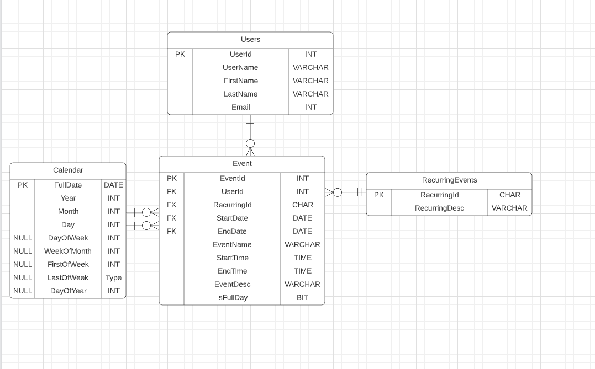
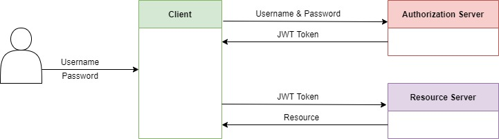

<!-- PROJECT LOGO -->
<br />
<div align="center">
  

<h3 align="center">Event Planner</h3>

  <p align="center">
    
  </p>
</div>

<!-- ABOUT THE PROJECT -->
## About The Project
Essentially an app where you can plan your day.  
The reason for an app like this is to be able to say:

_“I need to remember to do this, let me put it in my calendar.”_

```
App Features: 
* Add events to calendar
* Update events already in the calendar
* Delete events that have been created
* Secure login
* Being able to view your day or week in advance
```

### Built With

* [.Net Core](https://docs.microsoft.com/en-us/aspnet/core/?view=aspnetcore-6.0)
* [MySQL](https://www.mysql.com/)
* [Secrets Manager](https://docs.microsoft.com/en-us/aspnet/core/security/app-secrets?view=aspnetcore-6.0&tabs=windows)
* [AWS Cognito](https://aws.amazon.com/cognito/)
* [oAuth 2.0](https://docs.microsoft.com/en-us/azure/active-directory/develop/v2-oauth2-auth-code-flow)

### Cloud Instance

* [AWS](https://bbd-internal-sso.awsapps.com/start#)

<!-- ERD UPLOAD -->
### Entity Relational Diagram
 

 <!-- API ENDPOINTS-->
 ### API Endpoints
 ```
 */api/Caledar/day
 */api/Caledar/month
 */api/Caledar/week
 */api/EventPlanner/DeleteEvent/{id}
 */api/EventPlanner/GetEvent/{id}
 */api/EventPlanner/GetUserWeekEvents
 */api/EventPlanner/GetEvenetsByDay/{id}/{date}
 */api/EventPlanner/UpdateEvent
 */api/EventPlanner/CeateEvent
 */api/Members/authentication
 ```
 
 <!-- AUTH DESCRIPTION -->
## How the authentication works:
JSON web token (JWT) was used to authenticate the users personal information in this program. JWT allows transmitting of data between parties as a JSON object in a secure and compact way. When a user wants to login to the web API they will provide a username and password which will be sent to an authorization server (AWS Cognito). If the username and password is correct a JWT token will be returned which the user can then send to the resource server (API backend), which will then provide the user with the resource they are looking for. However, if the username and password is incorrect the client will be unauthorised to view the resource they are wanting to review. 

 ### Authentication Diagram
  

<!-- GETTING STARTED -->
## Getting Started

If you wish to test out the code and run the DB instance, please follow the instructions below

### Prerequisites

* Cloud Formation Stack Endpoint

  _If you wish to run on a cloud service_
  
  _e.g. [AWS](https://bbd-internal-sso.awsapps.com/start#)_

* Application To Run Endpoint
  - Visual Studio or,
  - Command line on Windows.


### Running the DB scripts

1. Create DB: run the file to create DB and its tables
```sh
TableCreation_Script.sql
```

2. Run bulk record data script
```sh
TablePopulate_Script.sql
```

### Running the API's

#### Running the scripts in Visual Code:
1. Open the project in Visual Code and run the Program.cs file.

2. In a browser, navigate to 
_https://localhost:port/swagger_
where _port_ is the randomly chosen port number displayed in the output.

3. Once the web API has been launched in your favourite web browser the API endpoints can be interacted with either through Postman or the Swagger interface.

#### Running the scripts from the command line in Windows:
1. Open the a command line window in the directory where the project is stored and run the following command:
```
dotnet run
```

2. In a browser, navigate to 
_https://localhost:port/swagger_
where _port_ is the randomly chosen port number displayed in the output.

3. Once the web API has been launched in your favourite web browser the API endpoints can be interacted with either through Postman or the Swagger interface.


<!-- MEET THE TEAM -->
## Development Team

- [ ] [Bawinile Mqwebedu](https://github.com/BawinileM)
- [ ] [Marie van der Merwe]()
- [ ] [Natasha Kumalo](https://github.com/Nate-5)
- [ ] [Nikita Smal](https://github.com/nikitasmal)
- [ ] [Phindi Mkhize](https://github.com/Ph1nd1)
- [ ] [Razeen Bahadoor](https://github.com/SparklingCouscous)
- [ ] [Yuvir Sharma](https://github.com/yuviiir)

<!-- REFERENCES -->
## References

* [The Hive](https://the-hive.bbd.co.za/)
* [Pluralsight](https://app.pluralsight.com/)
* [C# documentation](https://docs.microsoft.com/en-us/dotnet/csharp/)
* [AWS documentation](https://docs.aws.amazon.com/)
